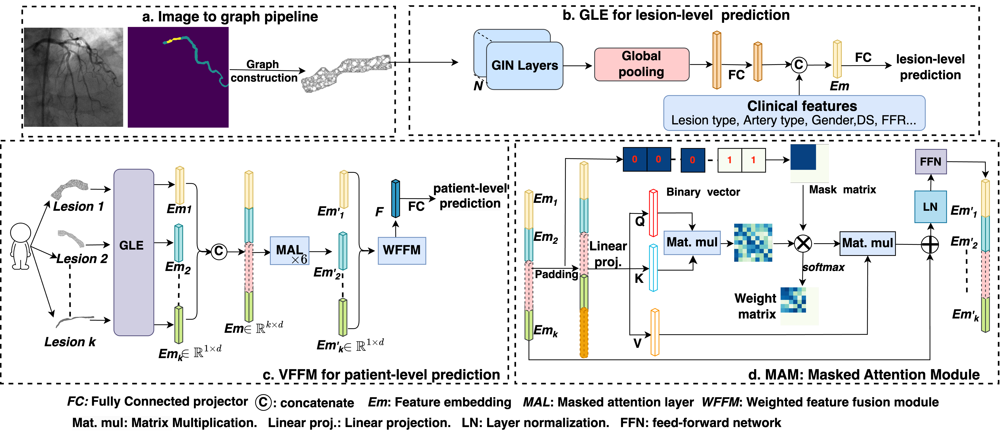

# AngioGraphCAD

Official implementation of the paper "Future cardiovascular events prediction from invasive coronary angiography: A graph representation learning perspective", an extended version of our conference paper titled [Graph Neural Network based Future Clinical Events Prediction from Invasive Coronary Angiography](https://ieeexplore.ieee.org/abstract/document/10635813)
 which was presented at IEEE International Symposium on Biomedical Imaging (ISBI), 2024.

## AngioGraphCAD Framework structure
AngioGraphCAD contains:  
(1) An image-to-graph pipeline for constructing a lesion graph from an ICA image.  
(2) GLE, a framework based on GNN for Lesion-level Events prediction, which employs N Graph Isomorphism Network (GIN) layers to extract geometric representations from a constructed graph, combined with clinical information for lesion-level events prediction.  
(3) VFFM, a Variable-input Features Fusion Module to fuse arbitrary numbers of lesion embeddings from the same patient into a unified patient-level representation for patient-level prediction.  

### Graph construction pipeline 
* [graph.ipynb](/graph.ipynb) demonstrates how to construct a lesion graph from an ICA image.
    
### GLE model for lesion-level prediction 
* the input of the GLE model is type of torch_geometric.data.Data, the data looks like: Data(x=[1598, 4], edge_index=[2, 9264], y=0.0, num_nodes=1598, lesion_points=[1598], patient_id='31-0003', lesion_id='31-0003_7', lesion_wide_feat_tensor=[1, 21], lesion_wide_feat_names=[21]). x is the node feature, edge_index is the edge connection between two node, y is the label, lesion_wide_feat is the clinical features.  
* code for GLE model is in [gle_model.ipynb](/gle_model.ipynb).   
* GLE training and validation curve can be found here:
https://wandb.ai/xsun/FAME2MI/reports/Untitled-Report--Vmlldzo5NDA4NDI3

### VFFM model for patient-level prediction 

